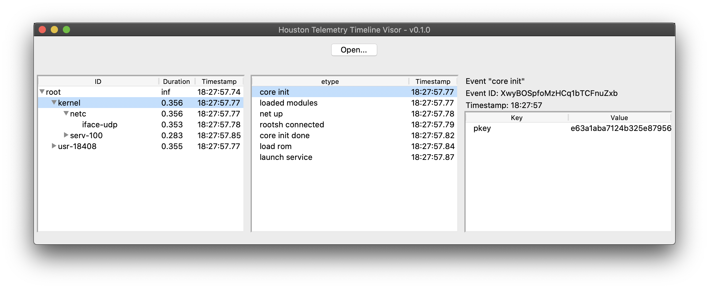

# houston



When debugging large distributed applications python std `logging` approaches just dont cut it.

`houston` works with two concepts:

1. `Event`s represent things we want to log, a unique event id is assigned at `event.eid` (or optionally can be passed to the event constructor), also the event is timestamped on `__init__`:
```python

from houston import Event

event = Event(
    "event type",
    data={"key": "value"}
    )
```
2. Then events are placed on a `Timeline`:
```python
from houston import get_timeline

# place event in root timeline, the root timeline
# is static like the root logger in std logging
get_timeline().place(event)

# events can trigger other events
event.trigger("other event type")

# get another timeline, get_timeline will search
# the entire timeline tree until finding a line with
# the name, or will create a timeline with that name
# as a child of root
get_timeline("other").place(
  Event("event on a sub timeline")
    )

# call fork to create a child timeline of a specific
# timeline
get_timeline("other").fork("ochild").place(Event("3 layers"))

# used to end a timeline, this will also call .join() on
# the child timeline
get_timeline("other").join()
```
3. At the end of the run dump the `Timelines` to a file to load it in the `houston` visor:
```python
with open("timeline_dump") as dumpfile:
    dumpfile.write(json.dumps(get_timeline().as_json()))
```
